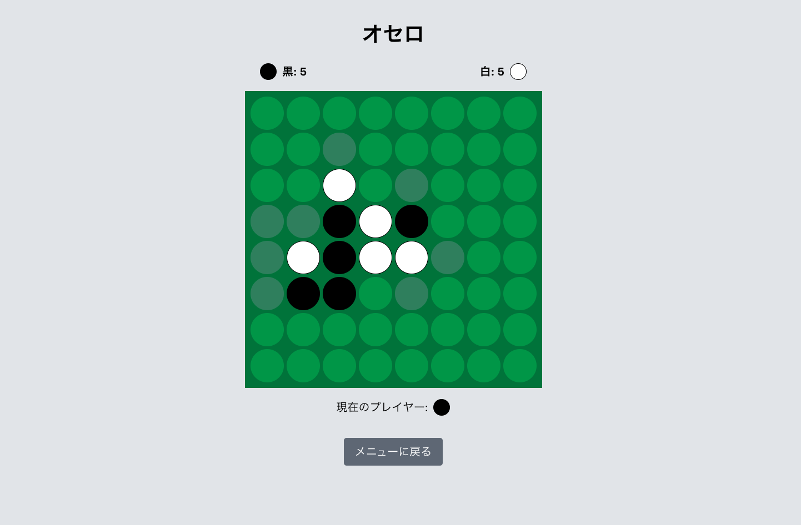

# オセロゲーム



このプロジェクトは React を使用して作成されたオセロ（リバーシ）ゲームです。2人プレイモードとAI対戦モード（3つの難易度）を備えています。

## 主な機能

- 2人プレイモード
- AI対戦モード（弱い、普通、強い）
- 動的なボード表示
- 有効な手の表示
- ゲーム終了時の勝敗判定

## 必要条件

- Node.js (v12.0.0以上)
- npm (v6.0.0以上)

Node.jsとnpmがインストールされていない場合は、[Node.jsの公式サイト](https://nodejs.org/)からダウンロードしてインストールしてください。

## セットアップ

1. このリポジトリをクローンします：

```bash
git clone https://github.com/yourusername/othello-game.git
cd othello-game
```

2. 必要な依存関係をインストールします：

```bash
npm install
```

このコマンドは、プロジェクトに必要なすべての依存関係（node_modules）をインストールします。これには数分かかる場合があります。

3. アプリケーションを開発モードで起動します：

```bash
npm start
```

4. ブラウザで [http://localhost:3000](http://localhost:3000) を開いてゲームをプレイします。

## 依存関係について

`npm install` コマンドは、`package.json` ファイルに記載されているすべての依存関係をインストールします。主な依存関係は以下の通りです：

- React
- React DOM
- Tailwind CSS

これらのパッケージとその依存関係はすべて `node_modules` ディレクトリにインストールされます。

## ビルド

本番用にアプリケーションをビルドするには、以下のコマンドを実行します：

```bash
npm run build
```

ビルドされたファイルは `build` ディレクトリに生成されます。

## トラブルシューティング

依存関係のインストールに問題がある場合は、以下を試してください：

1. `node_modules` ディレクトリと `package-lock.json` ファイルを削除します。
2. npm のキャッシュをクリアします：`npm cache clean --force`
3. 再度 `npm install` を実行します。

## 技術スタック

- React
- Tailwind CSS

## ライセンス

このプロジェクトは MIT ライセンスの下で公開されています。詳細は [LICENSE](LICENSE) ファイルを参照してください。
